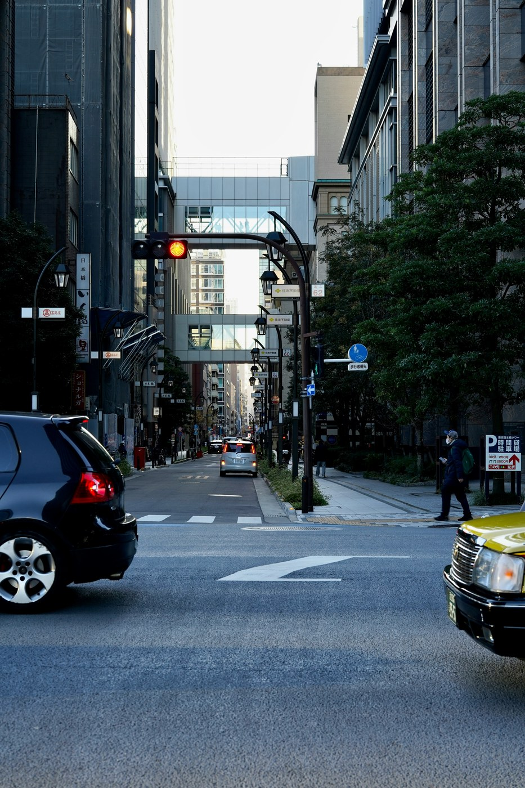
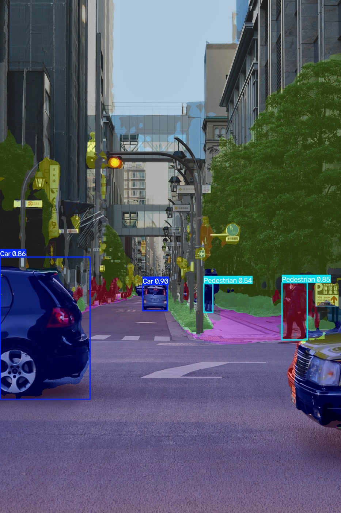
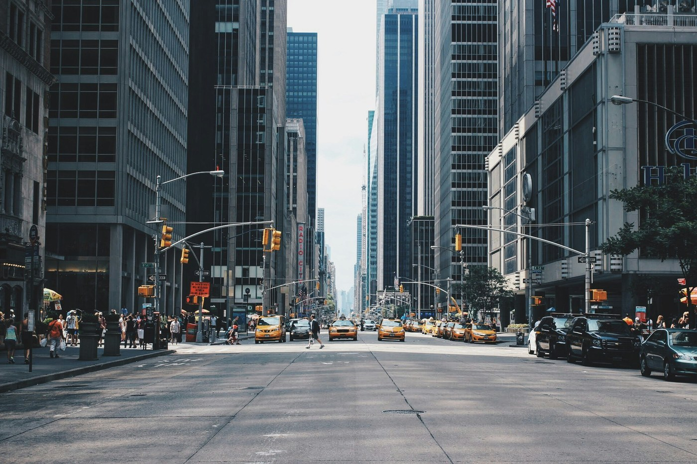
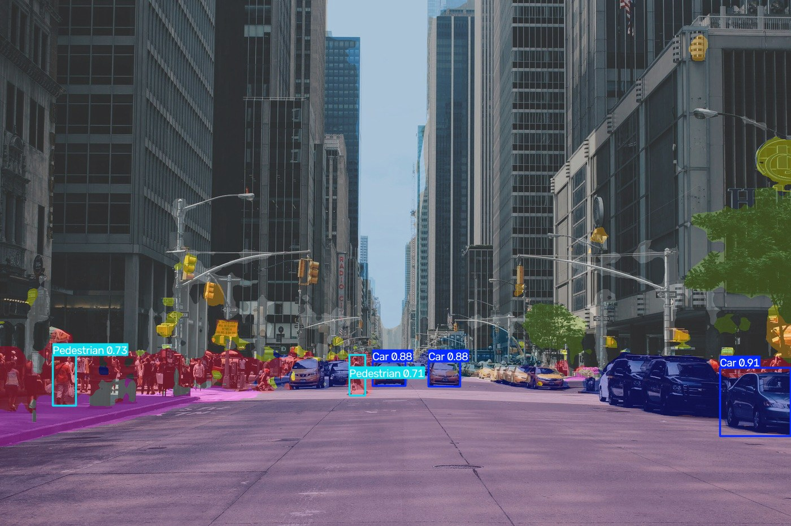

## SceneDetect

Object detection and semantic segmentation for autonomous driving scenes by combining YOLO finetuned on KITTI for object detection along with a SegFormer finetuned on Cityscapes into a single image inference pipeline, deployed as app on Hugging Face Spaces.

Given any street scene image, the pipeline overlays SegFormer's per-pixel scene segmentation  underneath the YOLO's object detections thereby producing a single annotated image. 
The pipeline was tested on real, unseen photos and neither model was trained or validated on either image.

### Demo
 Input | Output |
|---|---|
|  |  |
|  |  |

### Inference Pipeline

The two models YOLO11n and SegFormer run independently on the same original image, detection gives discrete boxes and segmentation provides a per-pixel class map which are merged only at the end, purely for visualization.
The segmentation mask is upsampled to the image's native resolution, colorized and blended underneath the image with YOLO's boxes drawn on top. Full architecture, coordinate-space and implementation details are discussed in [Inference Pipeline](#inference-pipeline) section below.

### Results at a Glance

| Component | Metric | Score |
|---|---|---|
| YOLO11n (KITTI, held-out **test** split) | mAP50 | 0.945 |
| YOLO11n (KITTI, held-out **test** split) | mAP50-95 | 0.741 |
| SegFormer-B0 (Cityscapes, val, log-weighted) | mIoU | 0.622 |

### Object Detection Using YOLO11n

**Ablation: frozen backbone vs full finetune, at two input resolutions**
Finetuning was done using 2 different ways where in first the first 10 layers of the model was frozen and then full finetuning to
assess how different methods impact the results. In both the methods image resolution was tuned frm 640 to 960
holding all other hyperparameters (batch, optimizer, augmentation, dataset split, epochs=100) constant, to isolate each variable's individual effect.

| Freeze | Img Size | Precision | Recall | mAP50 | mAP50-95 |
|---|---|---|---|---|---|
| 10 | 640 | 0.893 | 0.797 | 0.882 | 0.630 |
| 10 | 960 | 0.925 | 0.865 | 0.926 | 0.703 |
| 0 | 640 | 0.908 | 0.853 | 0.915 | 0.686 |
| 0 | 960 | 0.935 | 0.891 | 0.947 | 0.745 |

** Both variables improved the results independently and their effects roughly stack (best model uses both). But their *magnitude* differs:
 
- Unfreezing the backbone alone (640, freeze 10→0): mAP50-95 **+0.056** (0.630 → 0.686)
- Increasing resolution alone (freeze=10, 640→960): mAP50-95 **+0.073** (0.630 → 0.703)

#### Best model: full fine-tune (freeze=0), imgsz=960, 100 epochs
 
| Class | Images | Instances | Precision | Recall | mAP50 | mAP50-95 |
|---|---|---|---|---|---|---|
| Car | 1009 | 4489 | 0.957 | 0.942 | 0.980 | 0.837 |
| Van | 328 | 448 | 0.948 | 0.960 | 0.985 | 0.836 |
| Truck | 155 | 166 | 0.928 | 0.958 | 0.977 | 0.858 |
| Cyclist | 173 | 237 | 0.915 | 0.831 | 0.913 | 0.645 |
| Pedestrian | 254 | 621 | 0.929 | 0.762 | 0.879 | 0.548 |
| **All** | **1121** | **5961** | **0.935** | **0.891** | **0.947** | **0.745** |
 

#### Precision vs. Recall: what's driving the improvement
 
| Freeze | Img Size | Precision | Recall | Gap (P − R) |
|---|---|---|---|---|
| 10 | 640 | 0.893 | 0.797 | 0.096 |
| 10 | 960 | 0.925 | 0.865 | 0.060 |
| 0 | 640 | 0.908 | 0.853 | 0.055 |
| 0 | 960 | 0.935 | 0.891 | 0.044 |

### Segmentation: SegFormer on Cityscapes
 
SegFormer-B0 was finetuned on Cityscapes 
Cityscapes data is heavily class imbalanced like road and building pixels dominate the dataset while classes like traffic light, motorcycle 
and bicycle are comparatively rare therefore a loss weighting strategy was implemented that helps rare classes without
destabilizing training on the common ones. For loss weighting strategy E-net style log weighting.

#### Individual classes IoU
| Class | IoU |
|---|---|
| Road | 0.964 |
| Sky | 0.913 |
| Car | 0.886 |
| Vegetation | 0.874 |
| Building | 0.858 |
| Sidewalk | 0.757 |
| Bus | 0.669 |
| Train | 0.610 |
| Person | 0.595 |
| Truck | 0.592 |
| Bicycle | 0.580 |
| Terrain | 0.560 |
| Wall | 0.516 |
| Traffic sign | 0.509 |
| Fence | 0.429 |
| Traffic light | 0.428 |
| Rider | 0.376 |
| Motorcycle | 0.368 |
| Pole | 0.332 |
| **mIoU (all 19)** | **0.622** |

